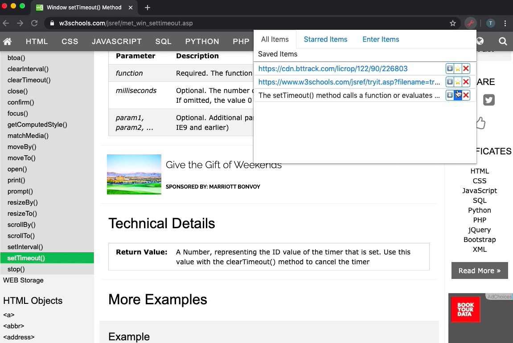

# web-clipper-chrome-extension

Right click and save your favorite parts of the internet in this handy, simple chrome extension.

Version 1 (11/12/2019):

https://www.youtube.com/watch?v=HrZeZ5-w0Mk&feature=youtu.be

Description: Right click text blocks and links and add them to the extension using context menu options.

